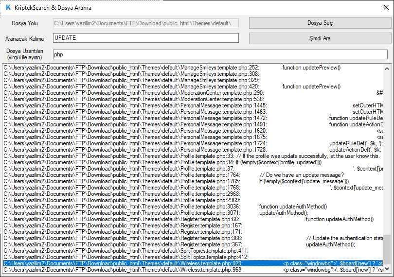

# KriptekSearch

Herkese merhaba,

Bilgisayarda metin araması yapacağım zaman windows işletim sisteminin arama çubuğu yetersiz kalıyordu. Bende günlük hayatta işimi kolaylaştıracak basit bir uygulama geliştirdim. Belirtmiş olduğunuz bir dosyanın bütün alt klasörlerinde istediğiniz kelimeyi arar. Örneğin oyun modunuzda bir fonksiyon var, fakat hangi kütüphaneye ait olduğunu bilmiyorsunuz. Tek tek bütün kütüphaneleri gezmektense fonksiyonun ismini yazıp, hangi dosya ve kaçıncı satırda olduğunu görebilirsiniz.

**Özellikler:**

- Aradığınız kelimenin hangi dosyada ve kaçıncı satırda olduğunu görebilirsiniz.
  
- Dosya Uzantıları kısmına * işaretini koyarsanız tüm dosya uzantılarını arar.
  
- Birden fazla dosya uzantısı aramak için araya , koyun. (Ör: pwn, php, html)
  
- Çıkan arama sonuçlarında satıra tıkladığınızda dosya yolunu CTRL + C işlemi yapar.